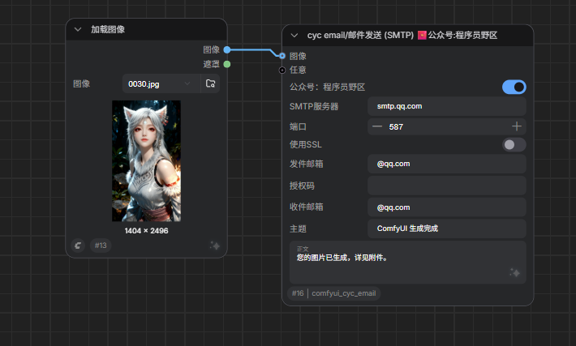

# comfyui-cyc-email

Custom node for sending emails via SMTP

**不要走第三方代理或者 VPN！**

[comfyui-cyc-email使用教程](https://mp.weixin.qq.com/s/__TIR-hIucVeC151BdPzfA)
更多 ComfyUI 教程 → [comfyui教程](https://mp.weixin.qq.com/mp/appmsgalbum?__biz=MzI1NjAxODkzMg==&action=getalbum&album_id=4612468398512635907#wechat_redirect)

---

## 使用说明

节点位置：`cyc email/邮件发送 (SMTP)`

必填参数：
- SMTP服务器、端口、是否SSL
- 发件邮箱、授权码（16位，不是登录密码）
- 收件邮箱、主题、正文

可选输入：
- 图像（自动作为附件发送）
- 任意（触发用，不处理）

## 示例工作流

`example_workflows/email.json` 拖入 ComfyUI 即可使用。

## 依赖

无外部依赖，仅使用 Python 内置模块。
